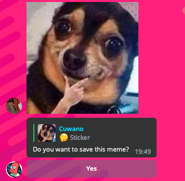
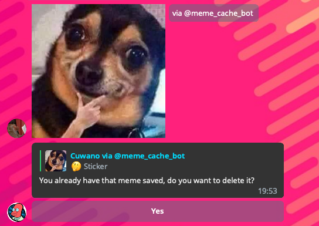

# MemeCacheBot

## Use of the `@meme_cache_bot`

Just start a conversation with `@meme_cache_bot` in Telegram.

Send a meme in any of these formats:
 - Sticker
 - GIF
 - Photo
 - Video

If you don't have the meme saved, the bot will ask if you want to save it

If you have the meme saved, the bot will ask if you want to delete it

## Deploy your own meme bot

- Create a `bot.token` file with a bot token in the root of the project
- Compile the bot executing `make compile`
- Create and migrate a database with `make db_setup`, check the `config/config.exs` file to set up your own database
- Execute the bot opening an `iex` interpreter with `make iex`
- (Optional) Create a release with `make release`
- (Optional) Execute the release with `make start` and stop it with `make stop`

The logs will be written into files, to see the logs execute:
 - `make debug_logs` to show all the logs
 - `make error_logs` to show error level logs only
